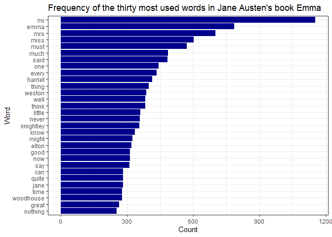
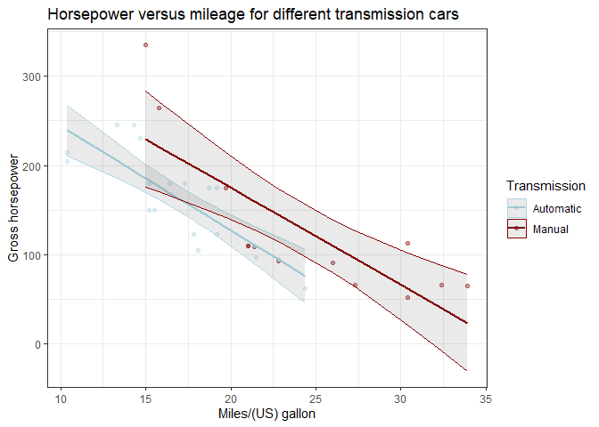

assignment-b4
================
Alex Pieters
2024-12-03

## <u>Instructions</u>

The aim of the assignment is completing 2 of 3 exercises using concepts
and tools covered in class (i.e. `stringr`, `purrr`, `regex`,
`tidyverse`, etc.). I choose exercises 1 and 3 with the following
instructions:

### Exercise 1

Take a Jane Austen book contained in the `janeaustenr` package, or
another book from some other source, such as one of the many freely
available books from [Project Gutenberg](https://dev.gutenberg.org/) (be
sure to indicate where you got the book from). Make a plot of the most
common words in the book, removing “stop words” of your choosing (words
like “the”, “a”, etc.) or stopwords from a pre-defined source, like the
`stopwords` package or `tidytext::stop_words`.

If you use any resources for helping you remove stopwords, or some other
resource besides the `janeaustenr` R package for accessing your book,
please indicate the source. We aren’t requiring any formal citation
styles, just make sure you name the source and link to it.

### Exercise 3

For this exercise, you’ll be evaluating a model that’s fit separately
for each group in some dataset. You should fit these models with some
question in mind.

Examples (do not use these examples):

- Maybe your model is a linear model (using `lm()`) for each country’s
  life expectancy over time in the `gapminder::gapminder` dataset, where
  you are interested in each country’s overall trend in life expectancy.

- Maybe your model is a distribution of body mass (using the `distplyr`
  [package](https://distplyr.netlify.app/)) for each penguin species in
  the palmerpenguins::penguins dataset, so that you can produce
  parametric prediction intervals (such as from a Normal distribution
  instead of using the `quantile()` function) for each species.

Your tasks are as follows.

1.  Make a column of model objects. Do this using the appropriate
    mapping function from the `purrr` package. Note: it’s possible
    you’ll have to make use of nesting, here.

2.  Evaluate the model in a way that interests you. But, you should
    evaluate something other than a single number for each group. Hint:
    you’ll need to use another `purrr` mapping function again.

3.  Print out this intermediate tibble for inspection (perhaps others as
    well, if it makes sense to do so).

4.  Unnest the resulting calculations, and print your final tibble to
    screen. Make sure your tibble makes sense: column names are
    appropriate, and you’ve gotten rid of columns that no longer make
    sense.

5.  Produce a plot communicating something about the result.

6.  Walk a reader through this analysis by providing an explanation as
    to what’s going on (in terms of a data analysis question and
    results, not necessarily in terms of what’s happening in the code).

Grading is as follows:

- 7.5 points: the “story” behind your data analysis.

- 7.5 points: the plot.

- 22.5 points: the calculations.

## <u>Solutions</u>

The exercises require the following packages to run the code:

``` r
## Load required packages
# if needed, install the packages before loading them using install.packages('name') in the console
library(janeaustenr) 
library(stopwords) 
library(tidyverse)
library(broom)
```

### Exercise 1

In this exercise, I will plot the most common words in Jane Austen’s
book *Emma* from the `janeaustenr` package without stop words found in
the `stopwords` package.

First, let’s find all of the words in the book ***Emma*** without stop
words and create a tibble.

``` r
words_without_stopwords <- emma %>%
  str_replace_all("[[:punct:]&&[^-']]|\\d|--+", " ") %>% # replace all punctuation except for apostrophes and hyphens (e.g., Emma's, to-day), or digits, or more than one hyphens with a space
  
  str_split(" ") %>% # split string by space
  unlist() %>% # create an atomic vector
  str_remove_all("^'|'$") %>% # remove leading or trailing apostrophes
  str_to_lower() %>% # convert string to lower case
  tibble(word=.) %>% # create a tibble with a column named word
  filter(!word %in% stopwords("en") & word!="") %>% # remove all of the stop words using the stopwords package and removes empty strings
  
  arrange(word) # arrange alphabetically
```

Now let’s count the number of repetitions of each word and sort them in
descending order.

``` r
word_repetition <- words_without_stopwords %>%
  count(word, sort=TRUE) # counting the repetition of each word and sort in descending order

length(word_repetition$word) # Number of unique words in the book without stop words
```

    ## [1] 7259

There are 7259 unique words, not including stop words, in the book Emma.
Therefore, plotting the frequency of all the words in the book would be
messy. Instead, let’s plot the frequency of the thirty most used words
in a barplot.

``` r
word_repetition %>%
  head(30) %>% # select the thirty most commonly used words
  ggplot(aes(x=n,y=reorder(word,n))) + # reorder words based on frequency
  geom_bar(stat="identity", fill ="darkblue") + # set length of bars equal to count value and set color
  labs(x="Count",y="Word",title="Frequency of the thirty most used words in Jane Austen's book Emma") +
  theme_bw()
```

<!-- -->

### Exercise 3

In this exercise, I will evaluate a linear model for each car’s
horsepower versus mileage using the `mtcars` dataset for assessing the
hypothesis that these variables are inversely proportional. My research
question therefore becomes: does a car’s mileage increase with
decreasing horsepower and how does the transmission type affect these
results?

First, let’s apply a linear model to evaluate mileage (mpg) and
horsepower (hp) for each transmission type (automatic versus manual).

``` r
compact_hp_vs_mpg <- mtcars %>%
  select(am,mpg,hp) %>% # select columns of interest: transmission (am where 0=automatic and 1=manual), mileage, and horsepower
  
  nest(data = c(mpg,hp)) %>% # nest the mpg and hp for each transmission type
  mutate(model = map(data,~lm(hp~mpg,data=.x))) # apply a linear model with y ~ x for each transmission type
print(compact_hp_vs_mpg)
```

    ## # A tibble: 2 × 3
    ##      am data              model 
    ##   <dbl> <list>            <list>
    ## 1     1 <tibble [13 × 2]> <lm>  
    ## 2     0 <tibble [19 × 2]> <lm>

Now, let’s extract the model output using `broom::augment()`. The output
includes the selected data, the fitted data, and the standard error of
fitted values.

``` r
expanded_hp_vs_mpg <- compact_hp_vs_mpg %>% 
  mutate(am, yhat = map(model, ~augment(.x,se_fit = TRUE)), .keep = "none") %>% # extract the model output and the standard error of the fitted values
  
  unnest(yhat) # expand the output for every row
print(expanded_hp_vs_mpg)
```

    ## # A tibble: 32 × 10
    ##       am    hp   mpg .fitted .se.fit .resid   .hat .sigma .cooksd .std.resid
    ##    <dbl> <dbl> <dbl>   <dbl>   <dbl>  <dbl>  <dbl>  <dbl>   <dbl>      <dbl>
    ##  1     1   110  21     164.     16.8 -53.9  0.102    52.2 0.0664      -1.08 
    ##  2     1   110  21     164.     16.8 -53.9  0.102    52.2 0.0664      -1.08 
    ##  3     1    93  22.8   144.     15.1 -51.2  0.0825   52.5 0.0465      -1.02 
    ##  4     1    66  32.4    39.4    24.5  26.6  0.217    54.3 0.0453       0.571
    ##  5     1    52  30.4    61.3    20.8  -9.27 0.156    55.1 0.00340     -0.192
    ##  6     1    65  33.9    23.1    27.6  41.9  0.275    52.9 0.166        0.936
    ##  7     1    66  27.3    95.1    16.3 -29.1  0.0955   54.3 0.0179      -0.582
    ##  8     1    91  26     109.     15.1 -18.3  0.0826   54.8 0.00594     -0.363
    ##  9     1   113  30.4    61.3    20.8  51.7  0.156    52.2 0.106        1.07 
    ## 10     1   264  15.8   221.     25.7  43.4  0.239    52.9 0.140        0.945
    ## # ℹ 22 more rows

Next, let’s calculate the 95% confidence interval (CI) of the model and
save the columns of interest (transmission type, horsepower, mileage,
CI) before plotting.

``` r
hp_vs_mpg <- expanded_hp_vs_mpg %>%
  select(am,hp,mpg,.fitted,.se.fit) %>%
  mutate(lower_95p_ci = .fitted - 1.96 *.se.fit) %>% # calculate the 95% lower confidence interval (z-score = 1.96)
  mutate(upper_95p_ci = .fitted + 1.96 *.se.fit) %>% # calculate the 95% upper confidence interval (z-score = 1.96)
  rename(transmission=am) %>% # Rename am to transmission
  mutate(transmission = case_when(
    transmission == 0 ~ "A",
    transmission == 1 ~ "M")) %>% # change 0 and 1 to automatic (A) and manual (M)
  select(-.se.fit) # remove column no longer needed for plotting

print(hp_vs_mpg)  
```

    ## # A tibble: 32 × 6
    ##    transmission    hp   mpg .fitted lower_95p_ci upper_95p_ci
    ##    <chr>        <dbl> <dbl>   <dbl>        <dbl>        <dbl>
    ##  1 M              110  21     164.        131.          197. 
    ##  2 M              110  21     164.        131.          197. 
    ##  3 M               93  22.8   144.        115.          174. 
    ##  4 M               66  32.4    39.4        -8.63         87.5
    ##  5 M               52  30.4    61.3        20.5         102. 
    ##  6 M               65  33.9    23.1       -31.0          77.1
    ##  7 M               66  27.3    95.1        63.3         127. 
    ##  8 M               91  26     109.         79.7         139. 
    ##  9 M              113  30.4    61.3        20.5         102. 
    ## 10 M              264  15.8   221.        170.          271. 
    ## # ℹ 22 more rows

Finally, let’s plot the horsepower against the mileage and overlay the
regression line per transmission type and the 95% confidence interval of
the linear prediction.

``` r
hp_vs_mpg %>%
  ggplot(aes(mpg,hp,colour=transmission)) + # plot hp (y) versus mpg (x)
  geom_point(alpha = 0.4) + # adjust alpha to show the overlap region between the transmission types
  geom_line(aes(y=.fitted), linewidth =0.8) + # add regression lines
   geom_ribbon(aes(ymin=lower_95p_ci, # lower 95% ci
                   ymax=upper_95p_ci), # upper 95% ci
              alpha = 0.1) +
  scale_colour_manual(values = c("lightblue", "darkred"), # change the colour for each group
                      name = "Transmission",
                      labels = c("Automatic","Manual")) + 
  labs(x="Miles/(US) gallon",y="Gross horsepower",title="Horsepower versus mileage for different transmission cars")+
  theme_bw()
```

<!-- -->

<u>Key takeaways:</u>

- The figure shows that generally the horsepower (hp) decreases as a
  function of mileage (mpg) and that manual cars have higher horsepower
  per mileage than automatic cars.

- The confidence interval of the automatic cars is narrower than their
  manual counterpart, suggesting that the linear model is more precise
  in predicting the hp for a given mpg in the former.
